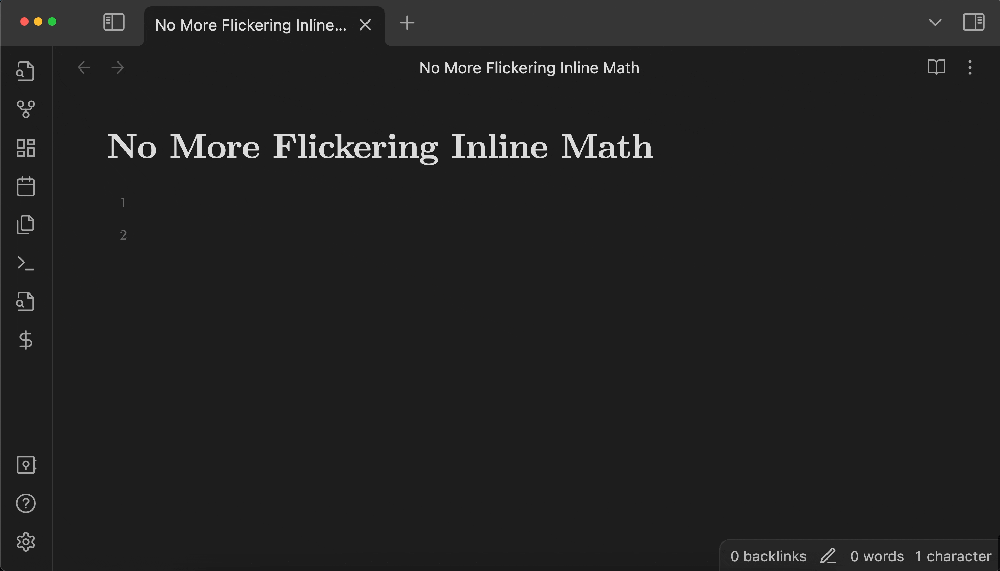

# No More Flickering Inline Math for Obsidian

With this [Obsidian.md](https://obsidian.md/) plugin, you will be no longer disturbed by the **flickering inline math**!

Turned OFF               | Turned ON
:-----------------------:|:------------------------:
 | 

Thank you to those who shared their ideas on the [forum](https://forum.obsidian.md/t/inline-math-allow-white-spaces-before-closing-dollar-signs/63551)!

> [!WARNING]
> Make sure you understand [how this plugin works](#how-does-it-work) before using it.

## Support Development

If you are enjoying this plugin, please consider supporting me by buying me a coffee!

<a href="https://www.buymeacoffee.com/ryotaushio" target="_blank"></a>

## Installation

You can find it in Obsidian's community plugins browser.

Also, you can participate in the beta-testing of the latest version by installing it using BRAT. 

1.  Install the [BRAT](obsidian://show-plugin?id=obsidian42-brat) community plugin and enable it.
2.  Go to **Options**. In the **Beta Plugin List** section, click on the **Add Beta plugin** button.
3.  Copy and paste `https://github.com/RyotaUshio/obsidian-inline-math` in the pop-up prompt and click on **Add Plugin**.
4.  (Optional) Turn on **Auto-update plugins at startup** at the top of the page.
5.  Go to **Community plugins > Installed plugins**. You will find "No more flickering inline math" in the list. Click on the toggle button to enable it.

## How does it work?

It's simple. Obsidian doesn't recognize `$[space]...$` or `$...[space]$` as a math.
So, when an inline math `$...$` is found, this plugin inserts `{}` at the beginning and end of it:

```latex
${} ... {}$
```

These braces are then hidden so that you are not disturbed by them.

## Don't like the brace pollution? Don't worry!

You can always safely clean up the braces by running the following commands:

- **Clean up braces in this note**
- **Clean up braces in all the opened notes**
